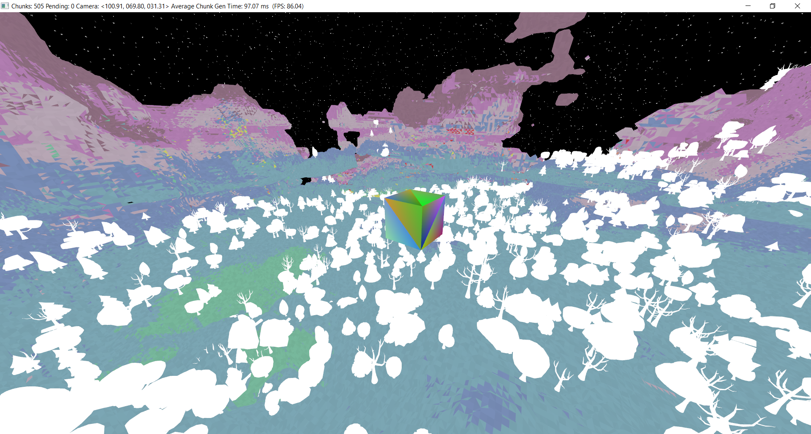

# PrairieGL
OpenGL wrapper for C#

A direct wrapper of openGL calls using windows system opengl32.dll 
This wrapper does not use pointers or unsafe code. 
The actual GL class is divided into two sections. About half of the calls use DLLImport and the rest use wglGetProcAddress to create delegates to unmanaged code. Unfortunatly this is the way Windows handles OpenGL. They have exports in the DLL file for only core 1.0 functions and the rest have to have entry points found through wglGetProcAddress. BUT wglGetProcAddress won't get the function calls that are exported by the DLL. 

This library also includes a wrapper for GLFW 3.3.8 which can be downloaded here:
[GLFW Download](https://www.glfw.org/download) Just remember to pay attention to the 32-bit vs 64-bit versions (Depending on what you have selected to compile)

Included are a group of samples translated from https://learnopengl.com/

Here's a sample screenshot of a current project I'm working on....

Don't mind the white trees... Still working on getting lighting to work. 

