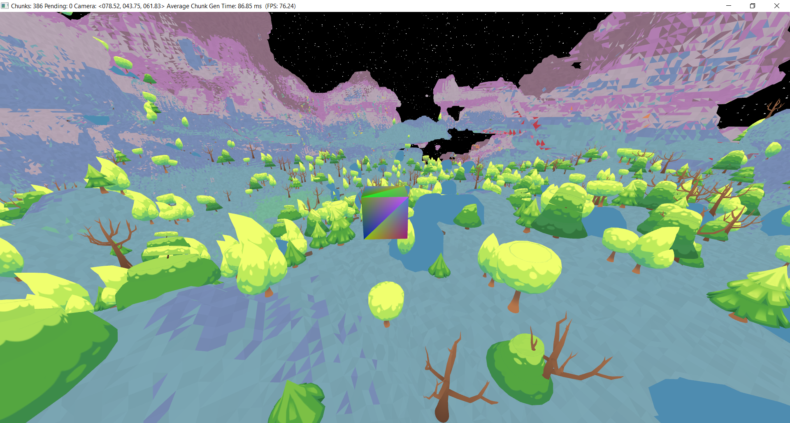

# PrairieGL
OpenGL wrapper for C#

A direct wrapper of openGL calls using windows system opengl32.dll 
This wrapper does not use pointers or unsafe code. 
The actual GL class is divided into two sections. About half of the calls use DLLImport and the rest use wglGetProcAddress to create delegates to unmanaged code. Unfortunatly this is the way Windows handles OpenGL. They have exports in the DLL file for only core 1.0 functions and the rest have to have entry points found through wglGetProcAddress. BUT wglGetProcAddress won't get the function calls that are exported by the DLL. 

This library also includes a wrapper for GLFW 3.3.8 which can be downloaded here:

[GLFW Download](https://www.glfw.org/download) Windows pre-compiled binaries

Once downloaded put the appropriate glfw3.dll file in the bin forlder. 
Just remember to pay attention to the 32-bit vs 64-bit versions (Depending on what you have selected to compile)

Included are a group of samples translated from [learnopengl](https://learnopengl.com/)

Menu 
Red Triangle 
Particles 
Render to Texture 
Normal Mapping 

Using GLFW for the window and input is super easy. **Take a look at the [tutorials](PrairieGL/TestPrairieGL/OpenGLTutorials/)**

There is no OpenGL init calls needed just start calling your functions and go. There are a few helper functions amongst the OpenGL calls that make life *slightly* easier. Like using `uint GenVertexArray()` vs `void GenVertexArrays(int n, uint[] arrays)`
or `BufferData<T>(BufferTargets target, T[] data, BufferUsages usage)` to handle IntPtrs internally rather than you needing to.

And finally there is a hack if your render pipline is falling on the wrong GPU (Like my computer has an Intel and a NVidia card and loves to choose the Intel card by default) 

```C#

        // This is a hack. DLLImport and call tells NVIDIA we want to render OpenGL using the better nvidia card if it exists. 
        [DllImport("opencl.dll", EntryPoint = "clGetPlatformIDs", CallingConvention = CallingConvention.Cdecl, CharSet = CharSet.Ansi)]
        static extern int GetPlatformIDs(int num_entries, [In, Out] IntPtr[] platforms, out int num_platforms);

        GetPlatformIDs(0, null, out int num_platforms);
```

Oh. And a slight gotcha In the OpenGL.Shader constructor "includeCommon" should probably be set to false by default as it's kind of broken right now. I'm still working out adding lighting and bones to it. It does have a base framework for layout locations and a material. If you set it to false you can pass a full vertex and fragment shader directly. As is the way in the tutorials. 

I've included Vulkan Bindings but I can't get past Tutorial #04 
I can't get past vkCreateDevice. It just gives me a nonsensical error:
"Typelib export: Type library is not registered. (0x80131165)'"
Windows 10 Home, 21H1 OS Build 19043.2364

Here's a sample screenshot of a current project I'm working on....

Don't mind the white trees... Still working on getting lighting to work. 

As always, if you find a problem please let me know.

